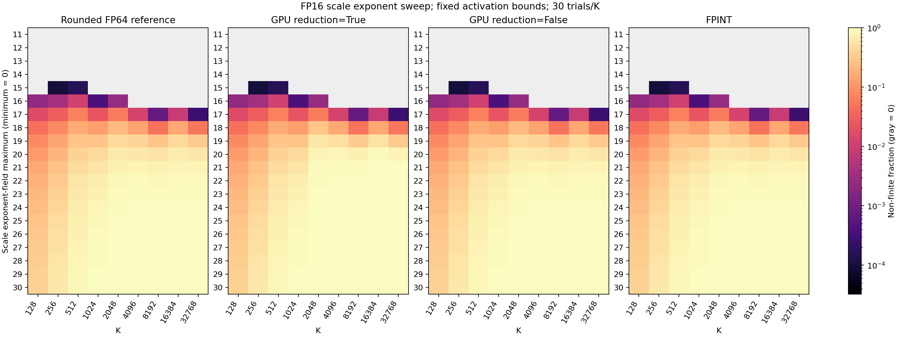
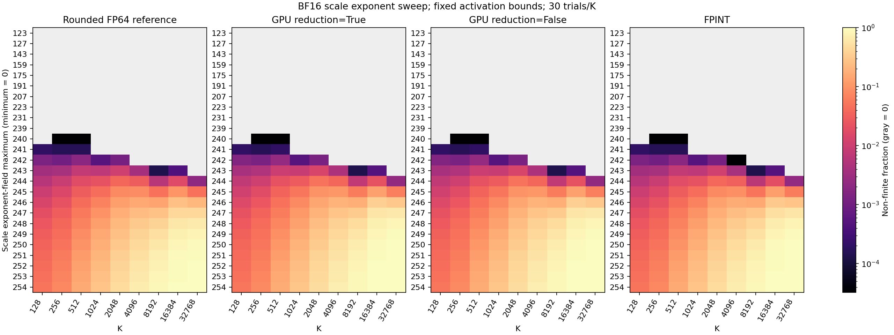

# Scale exponent sweep: fixed activation, signed uniform fields

Activation의 기존 K별 exponent 상한을 고정하고 scale exponent field의 상한만 넓힌 실험이다.
Sign과 mantissa는 독립 uniform raw field로 샘플링하며 음수·양수·0·subnormal scale을 포함한다.
이 scale은 양수 quantization scale 분포를 재현하기 위한 것이 아니라 산술 finite 범위를 시험하기 위한 것이다.

## 공통 설정

- Scale exponent field: discrete uniform [0, Emax], Inf/NaN 입력 field는 제외
- Scale sign: uniform {0,1}; mantissa: FP16 [0,1023], BF16 [0,127]
- Activation과 scale은 같은 dtype; signed INT4 [-8,7] uniform; zero-point=0; bias 없음
- MXU rows=128, group size=128, extra bits=19/10; scale은 output channel × K-group마다 독립
- 같은 K/trial은 모든 Emax에서 동일 activation/weight 및 scale sign/mantissa를 사용
- Scale exponent도 동일 U~Uniform[0,1)에서 floor(U × (Emax+1))로 매핑
- Scale 입력은 finite여도 dequantization, tile scaling, accumulation, output cast에서 Inf/NaN이 발생할 수 있음
- FP64 reference, dtype-rounded reference, GPU reduction True/False, FPINT의 finite/±Inf/NaN을 각각 기록
- 공통 finite는 위 다섯 출력의 교집합; finite mask로 원소를 제외하지 않으며 전체 출력 수가 항상 분모
- 99.9% 기준은 이전 실험과 같은 K별 pooled-trial 기준이며 sweep 중단 조건이 아님
- RMSE/ULP 순위가 아니라 finite coverage를 측정하는 실험

## 측정 결과

| Dtype | Largest tested Emax meeting target for every K | Worst-K common at that Emax | Next tested Emax | Worst-K common at next Emax |
| :--- | ---: | ---: | ---: | ---: |
| FP16 | 15 | 99.9837% | 16 | 98.8704% |
| BF16 | 241 | 99.9805% | 242 | 99.7461% |

### FP16

- 실행 상태: completed; GPU: NVIDIA RTX PRO 6000 Blackwell Server Edition
- PyTorch 2.7.0+cu128, CUDA 12.8; 완료 UTC: 2026-09-22T12:40:53.684582+00:00
- M=32, N=32; K=[128, 256, 512, 1024, 2048, 4096, 8192, 16384, 32768]; K당 30 trials; base seed=20260915
- Activation exponent max: {'128': 24, '256': 24, '512': 24, '1024': 23, '2048': 23, '4096': 22, '8192': 21, '16384': 21, '32768': 20}
- Emax sweep: [11, 12, 13, 14, 15, 16, 17, 18, 19, 20, 21, 22, 23, 24, 25, 26, 27, 28, 29, 30]; 총 5400 cases
- 모든 case의 FP64 reference finite: True
- 모든 K에서 common finite ≥99.9000%인 시험 상한: [11, 12, 13, 14, 15]
- CUDA/QCOL reference 검사: 180/180; 각 Emax/K의 첫 1 trial 검사
- 검사는 finite 값 exact equality, NaN 위치 일치, Inf 부호 일치 기준; NaN payload bit는 비교하지 않음

| Scale Emax | Max normal exponent Emax−bias | Rounded ref finite | GPU True finite | GPU False finite | FPINT finite | Common finite | Worst-K common |
| ---: | ---: | ---: | ---: | ---: | ---: | ---: | ---: |
| 11 | -4 | 100.0000% | 100.0000% | 100.0000% | 100.0000% | 100.0000% | 100.0000% |
| 12 | -3 | 100.0000% | 100.0000% | 100.0000% | 100.0000% | 100.0000% | 100.0000% |
| 13 | -2 | 100.0000% | 100.0000% | 100.0000% | 100.0000% | 100.0000% | 100.0000% |
| 14 | -1 | 100.0000% | 100.0000% | 100.0000% | 100.0000% | 100.0000% | 100.0000% |
| 15 | 0 | 99.9971% | 99.9971% | 99.9971% | 99.9971% | 99.9971% | 99.9837% |
| 16 | 1 | 99.7761% | 99.7761% | 99.7761% | 99.7761% | 99.7761% | 98.8704% |
| 17 | 2 | 97.6154% | 97.5803% | 97.6154% | 97.6154% | 97.5796% | 93.3659% |
| 18 | 3 | 88.4187% | 87.6490% | 88.4183% | 88.4187% | 87.6465% | 71.0319% |
| 19 | 4 | 70.1053% | 65.4995% | 70.1063% | 70.1053% | 65.4955% | 40.5632% |
| 20 | 5 | 52.0927% | 41.4251% | 52.0913% | 52.0927% | 41.4236% | 7.0931% |
| 21 | 6 | 39.2267% | 30.0434% | 39.2256% | 39.2267% | 30.0416% | 0.2181% |
| 22 | 7 | 30.7737% | 25.3939% | 30.7708% | 30.7737% | 25.3932% | 0.0000% |
| 23 | 8 | 25.3490% | 22.3242% | 25.3498% | 25.3490% | 22.3220% | 0.0000% |
| 24 | 9 | 21.7245% | 20.0828% | 21.7242% | 21.7245% | 20.0817% | 0.0000% |
| 25 | 10 | 19.1233% | 18.2335% | 19.1240% | 19.1233% | 18.2321% | 0.0000% |
| 26 | 11 | 17.1542% | 16.6442% | 17.1546% | 17.1546% | 16.6421% | 0.0000% |
| 27 | 12 | 15.6127% | 15.3682% | 15.6138% | 15.6127% | 15.3664% | 0.0000% |
| 28 | 13 | 14.4387% | 14.3063% | 14.3667% | 14.4387% | 14.3056% | 0.0000% |
| 29 | 14 | 13.4136% | 13.3377% | 13.3655% | 13.4136% | 13.3359% | 0.0000% |
| 30 | 15 | 12.5687% | 12.5152% | 12.5351% | 12.5687% | 12.5145% | 0.0000% |

전체 평균과 함께 worst-K를 확인한다. 아래 경계는 시험한 Emax에 대한 관측값이며 미측정 범위의 보장은 아니다.

| K | Largest tested Emax with common finite ≥ target | First tested Emax below target |
| ---: | ---: | ---: |
| 128 | 15 | 16 |
| 256 | 15 | 16 |
| 512 | 15 | 16 |
| 1024 | 16 | 17 |
| 2048 | 15 | 16 |
| 4096 | 16 | 17 |
| 8192 | 17 | 18 |
| 16384 | 16 | 17 |
| 32768 | 17 | 18 |



그림은 nonfinite 비율을 log 색상으로 표시한다. 회색은 nonfinite=0이다. 세로축 간격은 시험한 field 값별 동일 간격이다.

Raw [JSON](../../results/fpint-scale-exponent-sweep/fp16.json), [case CSV](../../results/fpint-scale-exponent-sweep/fp16.csv), [K별 summary CSV](../../results/fpint-scale-exponent-sweep/fp16-summary.csv).

### BF16

- 실행 상태: completed; GPU: NVIDIA RTX PRO 6000 Blackwell Server Edition
- PyTorch 2.7.0+cu128, CUDA 12.8; 완료 UTC: 2026-09-22T12:44:43.343410+00:00
- M=32, N=32; K=[128, 256, 512, 1024, 2048, 4096, 8192, 16384, 32768]; K당 30 trials; base seed=20260915
- Activation exponent max: {'128': 136, '256': 136, '512': 136, '1024': 135, '2048': 135, '4096': 134, '8192': 133, '16384': 133, '32768': 132}
- Emax sweep: [123, 127, 143, 159, 175, 191, 207, 223, 231, 239, 240, 241, 242, 243, 244, 245, 246, 247, 248, 249, 250, 251, 252, 253, 254]; 총 6750 cases
- 모든 case의 FP64 reference finite: True
- 모든 K에서 common finite ≥99.9000%인 시험 상한: [123, 127, 143, 159, 175, 191, 207, 223, 231, 239, 240, 241]
- CUDA/QCOL reference 검사: 225/225; 각 Emax/K의 첫 1 trial 검사
- 검사는 finite 값 exact equality, NaN 위치 일치, Inf 부호 일치 기준; NaN payload bit는 비교하지 않음

| Scale Emax | Max normal exponent Emax−bias | Rounded ref finite | GPU True finite | GPU False finite | FPINT finite | Common finite | Worst-K common |
| ---: | ---: | ---: | ---: | ---: | ---: | ---: | ---: |
| 123 | -4 | 100.0000% | 100.0000% | 100.0000% | 100.0000% | 100.0000% | 100.0000% |
| 127 | 0 | 100.0000% | 100.0000% | 100.0000% | 100.0000% | 100.0000% | 100.0000% |
| 143 | 16 | 100.0000% | 100.0000% | 100.0000% | 100.0000% | 100.0000% | 100.0000% |
| 159 | 32 | 100.0000% | 100.0000% | 100.0000% | 100.0000% | 100.0000% | 100.0000% |
| 175 | 48 | 100.0000% | 100.0000% | 100.0000% | 100.0000% | 100.0000% | 100.0000% |
| 191 | 64 | 100.0000% | 100.0000% | 100.0000% | 100.0000% | 100.0000% | 100.0000% |
| 207 | 80 | 100.0000% | 100.0000% | 100.0000% | 100.0000% | 100.0000% | 100.0000% |
| 223 | 96 | 100.0000% | 100.0000% | 100.0000% | 100.0000% | 100.0000% | 100.0000% |
| 231 | 104 | 100.0000% | 100.0000% | 100.0000% | 100.0000% | 100.0000% | 100.0000% |
| 239 | 112 | 100.0000% | 100.0000% | 100.0000% | 100.0000% | 100.0000% | 100.0000% |
| 240 | 113 | 99.9993% | 99.9993% | 99.9993% | 99.9993% | 99.9993% | 99.9967% |
| 241 | 114 | 99.9942% | 99.9939% | 99.9939% | 99.9942% | 99.9939% | 99.9805% |
| 242 | 115 | 99.9331% | 99.9193% | 99.9193% | 99.9327% | 99.9190% | 99.7461% |
| 243 | 116 | 99.5877% | 99.4806% | 99.4806% | 99.5797% | 99.4781% | 98.6263% |
| 244 | 117 | 98.3894% | 97.9366% | 97.9395% | 98.2961% | 97.9246% | 95.0586% |
| 245 | 118 | 94.9519% | 93.5142% | 93.5171% | 94.3873% | 93.4802% | 86.0905% |
| 246 | 119 | 88.4426% | 84.9834% | 84.9877% | 86.7495% | 84.9287% | 64.2904% |
| 247 | 120 | 80.4387% | 75.3056% | 75.3078% | 77.6866% | 75.2597% | 37.8288% |
| 248 | 121 | 72.7969% | 67.3940% | 67.3969% | 69.7725% | 67.3510% | 16.1784% |
| 249 | 122 | 66.4688% | 61.8475% | 61.8500% | 63.8495% | 61.8222% | 6.4323% |
| 250 | 123 | 61.4717% | 57.7445% | 57.7452% | 59.4166% | 57.7181% | 2.2298% |
| 251 | 124 | 57.4942% | 54.6115% | 54.6137% | 55.9936% | 54.5964% | 0.8105% |
| 252 | 125 | 54.3034% | 52.0150% | 52.0171% | 53.2245% | 52.0005% | 0.3158% |
| 253 | 126 | 51.7195% | 49.8850% | 49.8861% | 50.9346% | 49.8752% | 0.0879% |
| 254 | 127 | 49.5407% | 48.0584% | 48.0595% | 49.0097% | 48.0509% | 0.0195% |

전체 평균과 함께 worst-K를 확인한다. 아래 경계는 시험한 Emax에 대한 관측값이며 미측정 범위의 보장은 아니다.

| K | Largest tested Emax with common finite ≥ target | First tested Emax below target |
| ---: | ---: | ---: |
| 128 | 241 | 242 |
| 256 | 241 | 242 |
| 512 | 241 | 242 |
| 1024 | 242 | 243 |
| 2048 | 241 | 242 |
| 4096 | 242 | 243 |
| 8192 | 243 | 244 |
| 16384 | 243 | 244 |
| 32768 | 243 | 244 |



그림은 nonfinite 비율을 log 색상으로 표시한다. 회색은 nonfinite=0이다. 세로축 간격은 시험한 field 값별 동일 간격이다.

Raw [JSON](../../results/fpint-scale-exponent-sweep/bf16.json), [case CSV](../../results/fpint-scale-exponent-sweep/bf16.csv), [K별 summary CSV](../../results/fpint-scale-exponent-sweep/bf16-summary.csv).

## 재현

저장소 루트에서:

```bash
conda activate spinquant
CUDA_VISIBLE_DEVICES=1 OMP_NUM_THREADS=4 MKL_NUM_THREADS=4 bash scripts/run_fpint_scale_sweep.sh
```

개별 범위는 measure_fpint_scale_sweep.py의 --scale-exp-max-values로 지정한다.
예: --activation-format fp16 --scale-exp-max-values 15,16,17,18,19,20.
Activation의 K별 상한은 변경하지 않는다. --reference-trials 30이면 모든 case를 QCOL reference와 검사한다.
Raw 파일은 로컬 results/ 아래에 있으며 gitignore 대상이다. 실행 시 사용한 소스 SHA256은 JSON environment에 기록했다.

## 해석

- Emax는 IEEE 저장 exponent field 상한이다. Emax−bias는 정상수의 최대 실제 exponent이며 mantissa 때문에 최대 크기는 2^(Emax−bias+1) 미만이다.
- BF16/FP16은 raw exponent 하한 0의 실제 값이 다르므로 동일 실수 입력에 대한 dtype 비교가 아니다.
- 범위를 넓히면 scale 분포도 달라진다. 동일 sign/mantissa를 유지해도 cancellation 때문에 finite 비율의 단조성은 보장되지 않는다.
- BF16 FPINT는 scale 곱과 K-tile 누적을 FP32로 수행한다. 최종 정확한 합이 finite여도 중간 단계는 overflow할 수 있다.
- Rounded FP64 reference의 nonfinite는 출력 dtype 범위 초과를 보여준다. Candidate의 추가 nonfinite에는 중간 연산 순서의 영향도 포함된다.
- Raw CSV는 ±Inf와 NaN을 분리하고, baseline dequantized weight의 nonfinite 수도 기록한다.
- 99.9% 기준 충족은 이 seed/shape/분포에 대한 관측이며, 모든 입력의 finite 보장이 아니다.

현재 사용할 범위는 [최종 설정](mxu128_scaled_gemm_experiment.md)에 정리했다.
기존 양수 log-uniform 실험은 [archive](archive/log-uniform-20260922/mxu128_scaled_gemm_experiment.md)에 보존한다.
